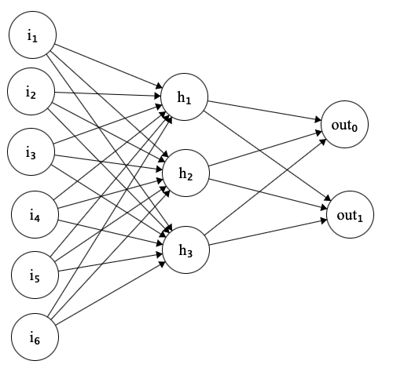
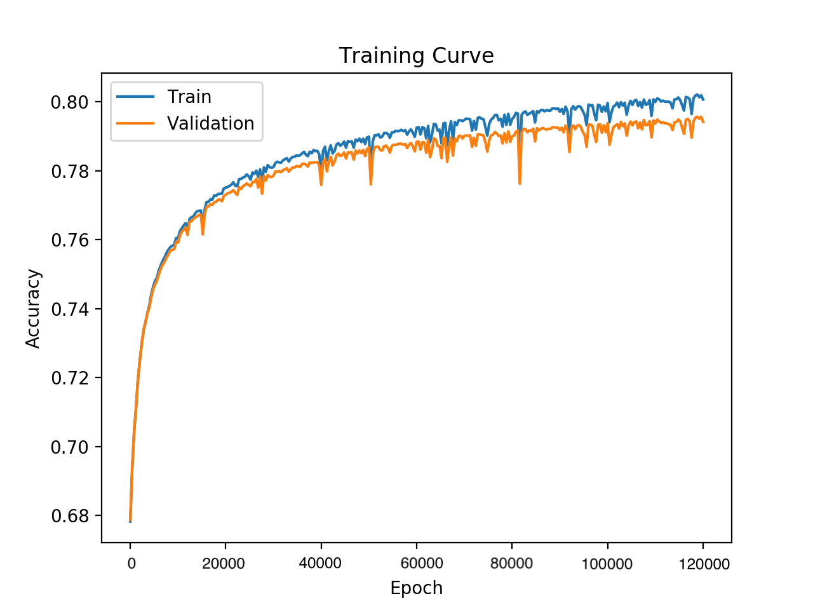

# EEG using MLP (Multi-Layer-Perceptron)
<div style="padding-left:10px; padding-right:15px;">An MLP model for classification between electrodes to determine ADHD and an API for people to use.</div>
<hr>

### Table of Contents
1. [Overview](#Overview)
3. [Model Training](#model-training)
3. [File Descriptions](#file-descriptions)
2. [User facing API in Flask](#user-facing-api-in-flask)

 
### Overview:
<div style="padding-left:10px; padding-right:15px;"> This is a MLP model that allows users to train ML on electrode data.

- Provides the users the ability to prepare data for the ML model
- It provides users the ability to create complex mini-batches of large data.
- Allows users to train model, plot graphs and saves checkpoint for early stopping.

Architecture:

</div>

### Model Training:
<div style="padding-left:10px; padding-right:15px;">
The MLP model is trained on the dataset provided by <a href="https://ieee-dataport.org/open-access/eeg-data-adhd-control-children">EEG data ADHD control childrens</a>. The dataset was divided as follows:

- Training set : 1.25M (~62.5%)
- Validation set : 375,000 (~18.75%)
- Testing set : 375,000 (~18.75%)

The data provided where electrode readings from both ADHD and control childrens. We further manipulated the data to only look into F3, F4, C3, C4, T7 and T8.



As we can observe, there is a slight overfit after epoch ~50. The maximum training accuracy the model reached is ~80%. Even with 80% accuracy, the model is showing promising results with classification.

</div>

### File Descriptions:
<div style="padding-left:10px; padding-right:15px;">
The whole project is divided into 5 different files for ease of readability and modifications. 

- `model.py`: The main file that contains the MLP model.
- `data_Preparation.py`: This files reads the data from the file specified, divides the files into datasets and prepare them to be used by the model.
- `train.py`: This files contains functions that trains the model, finds it's accuracy and save checkpoints for early stopping purposes.
- `model_loader.py`: This file is used to load a checkpoint, and find result of electrode reading.


</div>

### User facing API in Flask:
A rest API is created in Flask so we can access the model's power in real time. The location for the REST API is: `https://eegtrainer.herokuapp.com/getResult`

The REST API send response between `0.0 - 1.0`. Values closer to 0.0 means control, whereas the values close to 1.0 means ADHD.

For example:
```sh
>> curl -d '{"data":[ -20,  121,   52,  347,  -20,   89]}' -H "Content-Type: application/json" -X POST https://eegtrainer.herokuapp.com/getResult
{"result":0.782608695652174}
```

</div>


